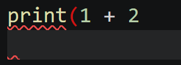
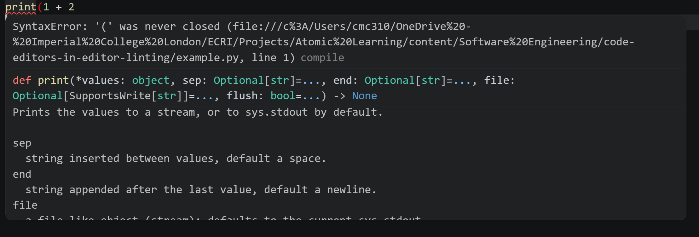
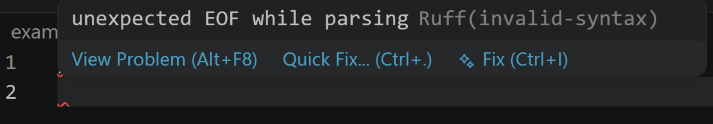

Many editors and IDEs can be configured to provide real-time linting feedback as code is being written. This allows developers to identify and fix issues immediately, improving code quality and development efficiency. The following is an example of a piece of Python code in VS Code where a set of parentheses is opened but not closed:

In this example, the word `print`{.python} is highlighted with a red underline, indicating a syntax error. The open parenthesis is also highlighted in red, signaling that it is not properly closed. There is also a red underline under the next line as the end of the file was reached while a parenthesis is still open. The exact display of linting outputs will vary depending on the editor, the linter, and its configuration.

In some case, hovering over the indication of an error will display a tooltip with more information about the issue:

In the above example, the tooltip describes the error in more detail, and provides the documentation of the `print`{.python} function to aid debugging.

Some linters may also provide suggestions for fixing the identified issues:

